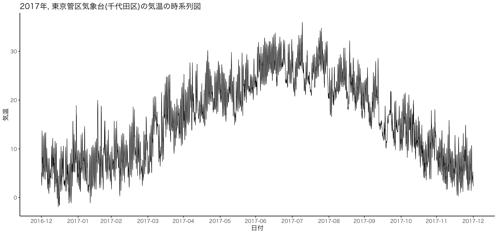
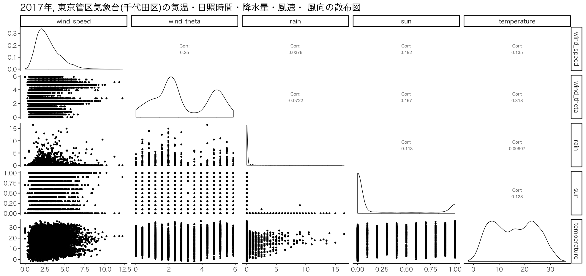

```{r set up, message=FALSE,echo=FALSE}
# Global options
library(knitr)
# opts_chunk$set(eval = FALSE)
opts_knit$set(width=75)
```

<!-- 前処理 -->

```{r echo=FALSE,eval=FALSE}
library(tidyverse)
library(lubridate)
library(scales)
library(summarytools)
library(GGally)
# input data
wind_data <- read_csv("csv/Tokyo_2017_wind.csv", skip=6,
                      col_names = c("date","wind_speed","info1","wind_direction","info2","info3"),
                      locale=locale(encoding='Shift_JIS'))
rain_data <- read_csv("csv/Tokyo_2017_rain.csv", skip=5,
                      col_names = c("date","rain","info1","info2","info3"))
sun_data <- read_csv("csv/Tokyo_2017_sun.csv", skip=5,
                     col_names = c("date","sun","info1","info2","info3"))
temp_data <- read_csv("csv/Tokyo_2017_temp.csv", skip=5,
                      col_names = c("date","temperature","info1","info2"))

# preprocess
wind_data <- wind_data %>% 
  mutate(
    angle = case_when( 
      wind_direction == "東" ~ 0,
      wind_direction == "東北東" ~ 22.5,
      wind_direction == "北東" ~ 45,
      wind_direction == "北北東" ~ 67.5,
      wind_direction == "北" ~ 90,
      wind_direction == "北北西" ~ 112.5,
      wind_direction == "北西" ~ 135,
      wind_direction == "西北西" ~ 157.5,
      wind_direction == "西" ~ 180,
      wind_direction == "西南西" ~ 202.5,
      wind_direction == "南西" ~ 225,
      wind_direction == "南南西" ~ 247.5,
      wind_direction == "南" ~ 270,
      wind_direction == "南南東" ~ 292.5,
      wind_direction == "南東" ~ 315,
      TRUE ~ 337.5)) %>% 
  mutate(wind_theta = angle * pi / 180)

# combine data
weather_data <- 
  wind_data %>% 
  dplyr::select(date,wind_speed,wind_theta) %>% 
  left_join(rain_data %>% 
              dplyr::select(date,rain),
            by="date") %>% 
  left_join(sun_data %>% 
              dplyr::select(date,sun),
            by = "date") %>% 
  left_join(temp_data %>% 
              dplyr::select(date,temperature),
            by = "date") %>% 
  mutate_all(funs(ifelse(is.na(.),0,.)))
# check data
p1 <- weather_data %>% 
  select(-date) %>% 
  ggpairs() +
  labs(title = "2017年, 東京管区気象台(千代田区)の気温・日照時間・降水量・風速・ 風向の散布図") +
  theme_set(theme_classic(base_size = 18,base_family = "HiraKakuPro-W3")) 

ggsave(file = "output/image/weather_corr_map.png", 
       plot = p1, dpi = 100, width = 19.73, height = 9.3)

p2 <- weather_data %>% 
  ggplot(aes(x=as.POSIXct(date),y=temperature)) +
  geom_line() +
  scale_x_datetime(breaks = date_breaks("month"), labels = date_format("%Y-%m")) +
  labs(title = "2017年, 東京管区気象台(千代田区)の気温の時系列図",
       x = "日付", y = "気温") +
  theme_set(theme_classic(base_size = 18,base_family = "HiraKakuPro-W3")) 

ggsave(file = "output/image/temperature_time_series.png", 
       plot = p2, dpi = 100, width = 19.73, height = 9.3)
# save data
```

# 第0賞: モチベーション

## 目標

**未来の気温を予測したい!!**

```{r, echo=FALSE, out.width = '90%'}

```

## 手法

- 時系列手法? 重回帰分析? 階層モデル? 色々試してみる...

<s>(模索しながら作成するので, 結果が出るのかはわかりません)</s>

```{r, echo=FALSE, out.width = '90%'}

```

# 第1章: 統計モデリングとStan

## 統計モデリングとは

- 統計モデリングとは確率モデルをデータにあてはめて, 現象の理解と予測を促すことであり, 確率モデルは確率分布とパラメータ(parameter)をつなぐ関係式からできている.

- パラメータとは解析前には値が未知の変数であり, 解析者がどのような値を持つか知りたい対象である.

- **確率モデルの利点は, 確率分布やパラメータをつなぐ関係式に背景知識を様々な形で組み込むことができる点である.**

## 統計モデリングの目的

解釈: 現象の理由やしくみを, 納得しやすいモデルを基に解釈することができる

予測: 得られたデータから未来のふるまいを予測する. 

- 解釈と予測は無関係でなく, 背景知識とよくマッチしていて, 納得しやすいモデルには頑健性(robustness)がある. 頑健性とは, 構築したモデルを変化させたり, 入力データを変えたりした場合でも解釈や予測が大きく変わらないという性質である.

- 機械学習の手法や古典的な手法を比較した時, 統計モデリングの利点は, 複雑な現実の問題に対しても, 予測性能に加えて, 結果の解釈性も高いという点である.

## 確率的プログラミング言語

- 確率的プログラム言語(Probabilistic programming language)とは, 様々な確率分布の関数や尤度計算に特化した関数が用意されており, 確率モデルをデータに当てはめることを目的としたプログラミング言語である.

- モデルの試行錯誤, 多数のモデルの比較や検証時において, Rにおける既存のパッケージ等よりも優れている.

## Stan

- 推定計算アルゴリズム: MCMC 

Hamilotonian Monte Carlo(HMC)の一実装である, No-U-Turn Sampler(NUTS)が使用されている.

- インターフェース: R, Python, MATLAB, Julia, Mathematica等

stanによりモデルを作成, パラメータ推定(MCMC)を行い, 得られた結果の可視化・活用を得意なインターフェイスで行うことができる. モデルの試行錯誤において非常に便利.

- メリット: デバッグのしやすさ, マニュアルの充実さ(version 2.17.0: 637ページ)

## MCMC

- 岩波データサイエンス Vol1を参照する

- 解説動画: https://www.youtube.com/watch?v=-H28H1unn0M

# 第2章: rstanの導入

## install.packages

- mac: Xcodeをインストール
- windows: Rtoolsをインストール

**pcのセッティング完了後**

```{r eval=FALSE}
install.packages("rstan", repos = "https://cloud.r-project.org/", dependencies=TRUE)
```

```{r}
library(rstan)
```

## check install

- インストールできているか, 確認する

```{r eval=FALSE}
fx <- inline::cxxfunction( signature(x = "integer", y = "numeric" ) , '
    return ScalarReal( INTEGER(x)[0] * REAL(y)[0] ) ;
' )
fx( 2L, 5 ) 
```

## setting

- 並列処理をするためのコード

```{r}
rstan_options(auto_write = TRUE)
options(mc.cores = parallel::detectCores())
```

## Directory

- ファイル構造について

```
├── Rstan_Introduction.Rproj
├── csv
│   ├── Tokyo_2017_rain.csv
│   ├── Tokyo_2017_sun.csv
│   ├── Tokyo_2017_temp.csv
│   └── Tokyo_2017_wind.csv
├── rmd
│   ├── Intro.Rmd
│   └── Intro.html
└── stan
    ├── simple_model.rds
    └── simple_model.stan
```

# 第3章: rstanの実行例と解釈

## stan code について1

```{stan, output.var="ex1",eval=FALSE}
data{
  モデル式に含まれる変数を定義
}
transformed data{
  data ブロックで定義した変数に対して, 変換を行う
}
parameters{
  モデル式に含まれる, サンプリングによって求めたいパラメータを定義
}
transformed parameters{
  parameters ブロックで定義した変数に対して変換等を行う
}
model{
  data や parameters などのブロックで定義された変数を利用して, モデル式を記述
}
generated quantities{
  サンプリングで得られたパラメータを利用して, さらに計算する
}
```

## stan code について2

**注意点**

- 各コードには*セミコロン(;)*を入れる
- コードの最終行には空行を必ず入れる
- `data`, `parameters`, `model`を主に使用.
- `generated quantities`はRで処理した方がラク

**一様分布に従う乱数をサンプリングするコード**

```{stan output.var="ex2",eval=FALSE}
parameters{
  real<lower=0,upper=1> a;
}
model{
  a ~ uniform(0,1); //一様分布
}
```

## model の実行例

- verbose: Iterationを表示するか
- iter: サンプリング数
- warmup: サンプリングに使用しない期間(デフォルト: iter/2)
- thin: 間引きする個数(デフォルト: 1)
- chains: マルコフ連鎖の個数

```{r eval=FALSE}
# モデルのコンパイル
model1 <- rstan::stan_model('stan/simple_model.stan')
# コンパイルしたモデルを使って, サンプリング
fit1 <- rstan::sampling(object = model1,
                 verbose = TRUE, 
                 iter = 500, 
                 chains = 3)
```

## 収束性について

**chain数が3以上で全てのパラメータで Rhat < 1.1となることを収束したと判断する**

```{r eval=FALSE}
fit1 # mcmcサンプリングの平均や四分位点
traceplot(fit1)
stan_plot(fit1) #
stan_dens(fit1) #パラメータの事後分布
```

# 第4章: rstanを活用した応用例

# 第5章: まとめ

## 参考文献

1. 松浦健太郎(2016), 「StanとRでベイズ統計モデリング」共立出版株式会社.
1. 気象庁ホームページ, https://www.data.jma.go.jp/gmd/risk/obsdl/index.php 
1. Stan Development Team, Stan Modeling Language User’s Guide and Reference Manual, https://github.com/stan-dev/stan/releases/download/v2.17.0/stan-reference-2.17.0.pdf
